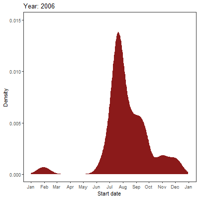

# California Fire: Project Overview 
This is an overview of the number of wild fire incident and acres burned along seasons and years. The goal of this project is to answer the following questions.
* Is there an trend of incident or the total burned acres over the years?
* Which area tends are likely to have wild fire?

## Code and Resources Used 
**Data:** CAL FIRE https://www.fire.ca.gov/incidents/  The data is listed in the bottom of the page. Two type of data files are available (Excel or JSON API). For some reason, the JSON API provided more data points from 2007 to present and  thus was used for this analysis.
**Packages:** dplyr, rjson, tidyverse, ggplot2, gganimate, gifski, transformr

## Data Cleaning and Recoding
* Parsed numeric date into year, month, and date
* Categorized acres burned and date

### Is there an trend of occurrence or the total burned acres over the years?
It seems that there is an increasing trend of fire incidents from year 2007 to 2017. The maximum of total number of occurrence was 330 in year 2017. However, we need to be aware that the improvement in monitoring system would allow us to have more observed fire incidents. 
 
### When is the peak of California wildfire of a year? 
A density plot of fire incidence was plotted against time series (x axis). There is a clearly window of fire incident between July and October.  

### When is the peak of California wildfire of a year? 

### The chances of fire incidents in June-May was 10% more after year 2009. 
 
### Which area tends are likely to have wild fire?
North California tends to have larger fire. Most fire happens  at mountain area. The central valley is relatively safer. Note: complete latitude and longitude were only available from 2013 to present. 
 
## Limitation
