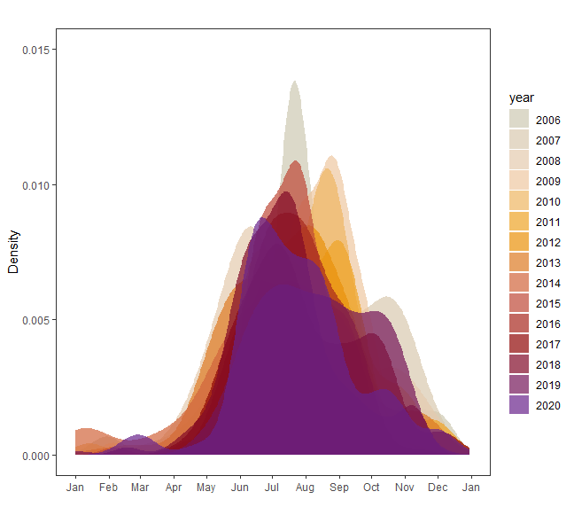

# California Fire: Project Overview 
This is an overview of the number of wild fire incident and acres burned along seasons and years. The goal of this project is to answer the following questions.
* Is there an trend of California wild fire over the years?
* Which area tends are likely to have wild fire?

#### Code and Resources Used 
**Data:** CAL FIRE (https://www.fire.ca.gov/incidents/)  The dataset is listed in the bottom of the page.  
**Packages:** dplyr, rjson, tidyverse, ggplot2, gganimate, gifski, transformr

## Is there an trend of California wild fire over the years?

**A density plot of wild fire incidence was plotted against time series (x axis).** 
The peak of California wild fire was between July and Octorber

It seems that there is an increasing trend of fire incidents from year 2007 to 2017. The maximum of total number of occurrence was 330 in year 2017. However, we need to be aware that the improvement in monitoring system would allow us to have more observed fire incidents.

 

## The chances of fire incidents in June-May from 2010 to 2019 was 10% more, compared to 2006-2009 

## Which area tends are likely to have wild fire?
North California tends to have larger fire. Most fire happens  at mountain area. The central valley is relatively safer. Note: complete latitude and longitude were only available from 2013 to present. 

