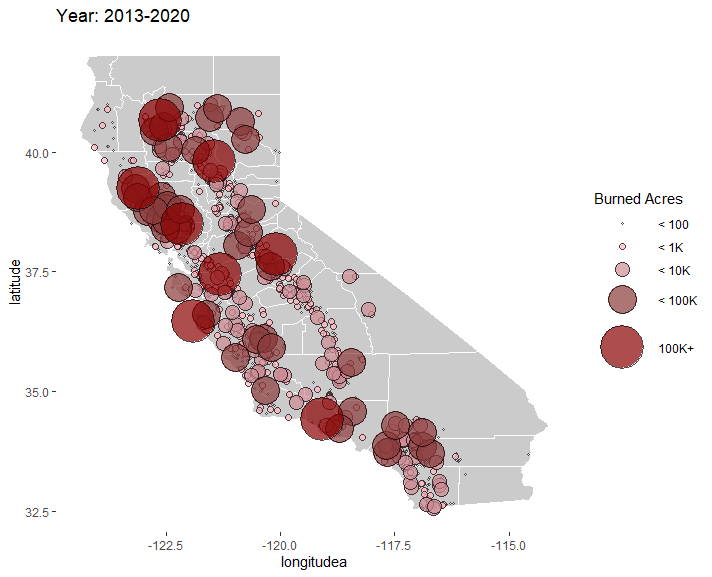

# California Fire: Project Overview 
This is an overview of the number of wild fire incident and acres burned along seasons and years. The goal of this project is to answer whether there is an trend of California wild fire over the years?

Photo by <a href="https://unsplash.com/@michaelheld?utm_source=unsplash&utm_medium=referral&utm_content=creditCopyText">Michael Held</a> on <a href="https://unsplash.com/s/photos/wildfire?utm_source=unsplash&utm_medium=referral&utm_content=creditCopyText">Unsplash</a>
  

## The peak of California wild fire was between July and Octorber.

## Total acres burned by year
1. The Harris Fire (South California) was in 2007. 
2. The Paradise wildfire (North California) was in 2018. 
3. Then, California's August Complex fire (North California) was in 2020.
 

## The wildfire season might start earlier, compared to 2006-2009
The chances of fire incidents in June-May (peachpuff color) 10% more after 2009.

## Which area tends are likely to have wild fire?
North California tends to have larger fire. Most fire happens  at mountain area. The central valley is relatively safer. Note: complete latitude and longitude were only available from 2013 to present. 

#### Code and Resources Used 
**Data:** CAL FIRE (https://www.fire.ca.gov/incidents/). The dataset is listed in the bottom of the page.  
**Packages:** dplyr, rjson, tidyverse, ggplot2, gganimate, gifski, transformr
